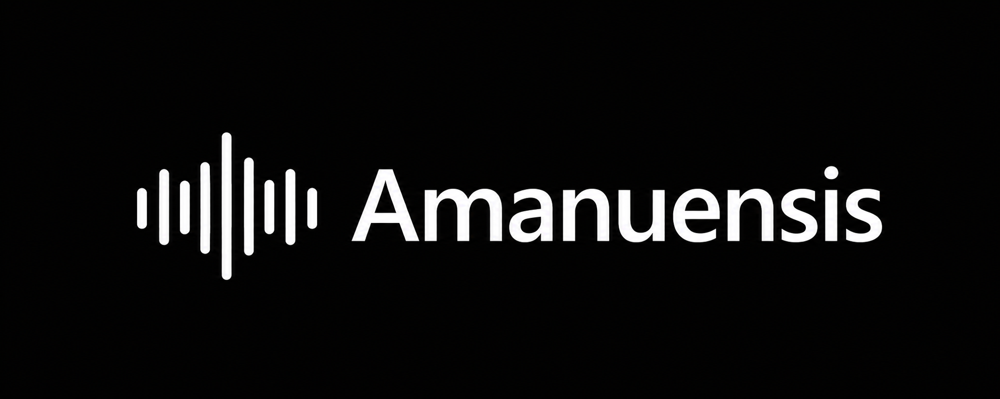

# Amanuensis



A small Windows desktop dictation app. Press `F9` to start and stop recording; Amanuensis transcribes locally and pastes the result into the active application.

## Features

- Local speech recognition with downloadable Sherpa-ONNX models
- Global `F9` dictation shortcut
- Compact dictation pill with live waveform and cancel/finish controls
- Settings window for model management and tray preferences
- Windows tray controls
- Windows ARM64 and x64 release builds

## Requirements

- Windows 11
- A microphone
- Rust 1.95+ for development

## Development

```text
cargo run --release
```

On first launch, download a speech model from the setup screen. The model is cached locally and reused on later launches.

## Usage

1. Launch Amanuensis.
2. Download a model during setup.
3. Press `F9` and speak.
4. Press `F9` again, or use the pill's finish button.

Press `Escape` to cancel an active recording. Open settings from the tray or the pill menu.

## Releases

Push a tag such as `v1.0.0` to build ARM64 and x64 Windows binaries and create a draft GitHub release.

## Attribution

The lifecycle sound effects in `assets/audio/` are selected from [OpenCode](https://github.com/anomalyco/opencode/tree/dev/packages/ui/src/assets/audio). See [THIRD_PARTY_NOTICES.md](THIRD_PARTY_NOTICES.md).
